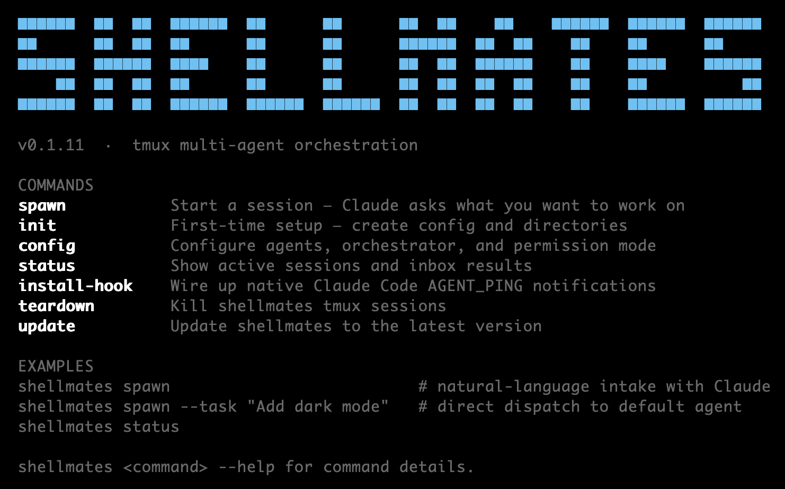

# shellmates

<div align="center">
  
</div>

<br />

<div align="center">
  <strong>Your terminal. Multiple AI agents. One shared goal.</strong>
</div>

<br />

```bash
npm install -g shellmates
```

Most people run one AI agent at a time. Shellmates lets you run many — Claude plans the work, Gemini writes the code, Codex verifies it — all coordinated through your terminal via tmux. No APIs to wire up. No infrastructure to manage. Just agents passing tasks like engineers at adjacent desks.

---

## How it works

When you describe a goal, Claude breaks it into tasks and dispatches them to worker agents running in tmux panes. Each worker runs in isolation, does its job, and signals back when it's done. Claude receives a native notification — no polling, no manual checking — reads the result, and decides what comes next.

```
you describe the goal to Claude
        ↓
Claude breaks it into tasks and dispatches via: shellmates spawn --task "..."
        ↓
Gemini (or Codex) picks up the task in its own tmux pane and gets to work
        ↓
worker finishes → writes result to inbox → signals Claude
        ↓
Claude wakes up, reads the result, dispatches the next task
        ↓
repeat until done
```

You stay in your pane the whole time. Workers run in parallel or in sequence — Claude decides based on what makes sense.

---

## The agents in action

<div align="center">
  
</div>

---

## Get started

```bash
npm install -g shellmates
shellmates init          # creates ~/.shellmates/ and a default config file
shellmates install-hook  # wires up native Claude notifications (run this once)
shellmates config        # choose your agent, orchestrator, and permission settings
```

Then start a session:

```bash
shellmates spawn
```

This opens Claude as your orchestrator. Claude greets you, asks what you want to work on, and handles the rest — breaking the goal into tasks and dispatching agents as needed. You just review results as they come in.

---

## Direct dispatch

If you already know exactly what you want done, skip the planning and send a task straight to a worker:

```bash
shellmates spawn --task "Add dark mode to the settings page"
shellmates spawn --task "Refactor the auth module" --agent codex
shellmates spawn --task-file plan.md --agent gemini --watch
```

This is useful when you're already in the middle of a session and want to fire off a specific task without describing the full picture again.

---

## Reusing warm agent panes

When a worker finishes a task, its pane stays alive. Instead of spinning up a fresh agent for the next task — with a cold start and new context — you can reuse the warm pane:

```bash
# First task — spawns a new pane
shellmates spawn --task "Write the API endpoint" --agent gemini

# Agent finishes → Claude receives a ping with the pane ID:
# AGENT_PING: job:job-123 reuse-pane:%46 status:complete RESULT: ...

# Follow-up task — reuses the warm pane, sends /clear to reset context
shellmates spawn --task "Write tests for that endpoint" --agent gemini --reuse-pane %46
```

Use `--reuse-pane` for sequential tasks on the same agent. Spawn fresh when you need two agents running in parallel.

---

## The notification hook

Without the hook, Claude has to poll the inbox — checking every few seconds, burning tokens doing nothing useful.

With the hook installed, a background watcher detects when a worker writes its result and uses Claude Code's native `asyncRewake` mechanism to wake Claude up exactly once. No polling. Claude gets notified, reads the result, and moves on.

```bash
shellmates install-hook
```

Run it once. It installs `~/.claude/hooks/shellmates-notify.sh` and adds the hook entry to `~/.claude/settings.json` automatically.

---

## Configuration

```bash
shellmates config
```

| Setting | What it controls | Options | Default |
|---|---|---|---|
| **Default agent(s)** | Which CLI handles worker tasks | `gemini`, `codex` | `gemini` |
| **Orchestrator** | Which CLI drives the session in pond mode | `claude`, `gemini`, `codex` | `claude` |
| **Worker permission mode** | Whether workers ask before modifying files | `default`, `bypass` | `default` |
| **Orchestrator permission mode** | Whether the orchestrator asks before running commands | `default`, `bypass` | `default` |

**Permission modes:**
- `default` — the agent asks before modifying files or running commands
- `bypass` — the agent runs fully autonomously, no confirmations. Per agent: `claude --dangerously-skip-permissions`, `gemini --yolo`, `codex --full-auto`

Worker and orchestrator permissions are independent — you can run a cautious orchestrator with autonomous workers, or flip it the other way. Set them once in `shellmates config` and every session picks them up automatically.

---

## Commands

| Command | What it does |
|---|---|
| `shellmates init` | First-time setup — creates `~/.shellmates/` and a default config |
| `shellmates config` | Change agents, orchestrator, and permission modes |
| `shellmates spawn` | Start a Claude-driven session, or dispatch a task directly |
| `shellmates status` | Show active sessions, config, and inbox results |
| `shellmates install-hook` | Install the PostToolUse hook for native Claude notifications |
| `shellmates teardown` | Kill all shellmates tmux sessions |
| `shellmates update` | Update to the latest version |

**`shellmates spawn` options:**

```
-t, --task <text>         Inline task text
-f, --task-file <path>    Path to a task file
-a, --agent <name>        gemini | codex (overrides default)
-s, --session <name>      tmux session name
-p, --project <path>      Working directory for the agent (default: cwd)
-w, --watch               Wait in terminal until the agent finishes
-r, --reuse-pane <paneId> Reuse a warm agent pane instead of spawning fresh
```

---

## Requirements

- [Node.js](https://nodejs.org/) 18+
- [tmux](https://github.com/tmux/tmux) — `brew install tmux`
- At least one worker agent: [Gemini CLI](https://github.com/google-gemini/gemini-cli) or [Codex CLI](https://github.com/openai/codex)
- [Claude Code](https://claude.ai/code) — for the orchestrator and native notifications

---

## License

MIT
